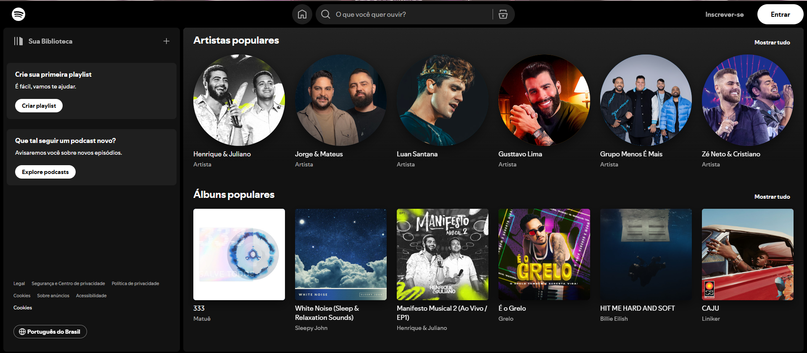
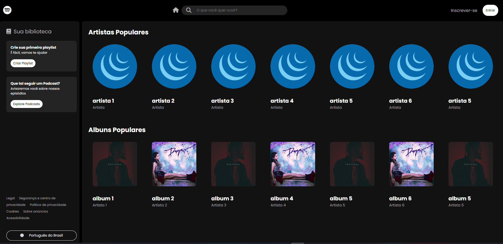

<h1 align="center"> Clone do Spotify </h1>

Projeto proprio criado com a finalidade de treinar o conhecimento em JS, CSS, HTML, Git/Github.
 

  <a href="#-aprendizado">Aprendizado</a>&nbsp;&nbsp;&nbsp;|&nbsp;&nbsp;&nbsp;
  <a href="#-tecnologias">Tecnologias</a>&nbsp;&nbsp;&nbsp;|&nbsp;&nbsp;&nbsp;
  <a href="#-projeto">Projeto</a>&nbsp;&nbsp;&nbsp;|&nbsp;&nbsp;&nbsp;
  <a href="#-layout">Layout</a>&nbsp;&nbsp;&nbsp;|&nbsp;&nbsp;&nbsp;
  <a href="#memo-licença">Licença</a>

  

 

  

## 👨‍💻 Aprendizado

Com esse projeto foi possível revisar o conhecimento nas tecnologias HTML, CSS e Javascript.

## 🚀 Tecnologias

Esse projeto foi desenvolvido com as seguintes tecnologias:

- HTML e CSS
- JavaScript
- Git e Github

## 💻 Projeto

O projeto do Clone do Spotify recria a tela principal da plataforma de música, contem alguns itens animados (botões).

- [Acesse o projeto finalizado, online](https://netinhosm1.github.io/clone-spotify/)

## 🔖 Layout

Você pode visualizar o layout do projeto através [DESSE LINK](https://open.spotify.com/intl-pt).

## :memo: Licença

Esse projeto está sob a licença MIT.

---

Feito por netinhosm
